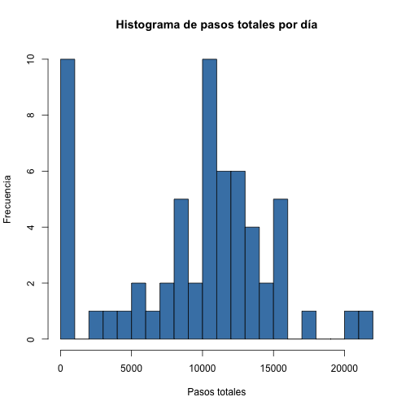
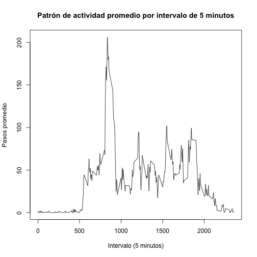
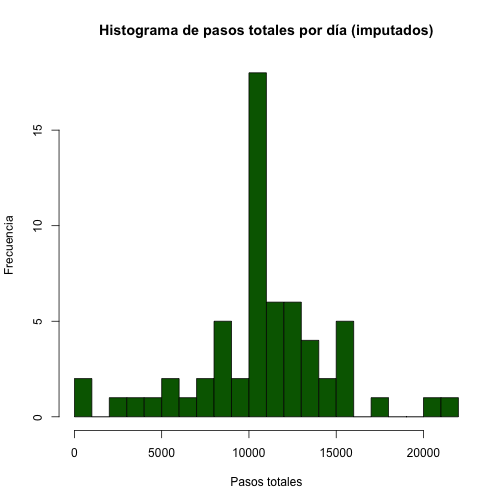
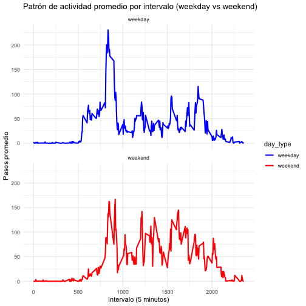

```r
# Lectura del dataset
data <- read.csv("activity.csv", header = TRUE, stringsAsFactors = FALSE)

# Conversión de la columna 'date' al formato Date
data$date <- as.Date(data$date, format = "%Y-%m-%d")
```


```r
# Calcular el total de pasos por día, ignorando NA
total_steps <- tapply(data$steps, data$date, sum, na.rm = TRUE)

# Crear un histograma de los pasos totales por día
hist(total_steps,
     main = "Histograma de pasos totales por día",
     ylab = "Frecuencia",
     xlab = "Pasos totales",
     col = "steelblue",
     breaks = 20)
```



```r
# Calcular la media y la mediana del total de pasos por día
mean_steps <- mean(total_steps)
median_steps <- median(total_steps)

# Mostrar resultados en la consola
mean_steps
```

```
## [1] 9354.23
```

```r
median_steps
```

```
## [1] 10395
```


```r
# Agrupar los datos por la columna 'interval' y calcular la media de 'steps' para cada intervalo de 5 minutos.
avg_steps_interval <- aggregate(steps ~ interval, data = data, FUN = mean, na.rm = TRUE)

# Crear un gráfico de línea que muestre el patrón de actividad promedio a lo largo del día.
plot(avg_steps_interval$interval, avg_steps_interval$steps,
     type = "l",
     main = "Patrón de actividad promedio por intervalo de 5 minutos",
     xlab = "Intervalo (5 minutos)",
     ylab = "Pasos promedio")
```



```r
# Identificar el intervalo con el mayor promedio de pasos.
max_interval <- avg_steps_interval[which.max(avg_steps_interval$steps), "interval"]

# Imprimir el intervalo con el mayor promedio de pasos
max_interval
```

```
## [1] 835
```


```r
# Calcular el número total de valores faltantes en la columna 'steps'
num_missing <- sum(is.na(data$steps))
num_missing
```

```
## [1] 2304
```

```r
# Estrategia de imputación: reemplazar NA en 'steps' con el promedio del intervalo correspondiente.
impute_steps <- function(steps, interval) {
  if (is.na(steps)) {
    return(avg_steps_interval$steps[avg_steps_interval$interval == interval])
  } else {
    return(steps)
  }
}

# Crear un nuevo dataset con los valores imputados
data_imputed <- data
data_imputed$steps <- mapply(impute_steps, data_imputed$steps, data_imputed$interval)

# Verificar que ya no queden NA en la columna 'steps'
sum(is.na(data_imputed$steps))
```

```
## [1] 0
```

```r
# Calcular el total de pasos por día usando el dataset con datos imputados
total_steps_imputed <- tapply(data_imputed$steps, data_imputed$date, sum)

# Crear un histograma de los pasos totales por día con datos imputados
hist(total_steps_imputed,
     main = "Histograma de pasos totales por día (imputados)",
     xlab = "Pasos totales",
     ylab = "Frecuencia",
     col = "darkgreen",
     breaks = 20)
```



```r
# Calcular la media y la mediana del total de pasos por día con datos imputados
mean_steps_imputed <- mean(total_steps_imputed)
median_steps_imputed <- median(total_steps_imputed)

# Imprimir la media y la mediana con datos imputados
mean_steps_imputed
```

```
## [1] 10766.19
```

```r
median_steps_imputed
```

```
## [1] 10766.19
```


```r
# Clasificar cada fecha en "weekday" o "weekend"
data_imputed$day_type <- ifelse(weekdays(data_imputed$date) %in% c("Saturday", "Sunday"),
                                "weekend", "weekday")
data_imputed$day_type <- as.factor(data_imputed$day_type)

# Calcular el promedio de pasos por intervalo para cada tipo de día (weekday y weekend)
avg_steps_daytype <- aggregate(steps ~ interval + day_type, data = data_imputed, FUN = mean)

# Instalar y cargar ggplot2 si no está instalada
if (!require(ggplot2)) install.packages("ggplot2", repos = "https://cloud.r-project.org")
```

```
## Loading required package: ggplot2
```

```r
library(ggplot2)

# Crear un panel plot para visualizar el patrón de actividad promedio por intervalo diferenciando días de semana y fines de semana.
ggplot(avg_steps_daytype, aes(x = interval, y = steps, color = day_type)) +
  geom_line(size = 1) +
  facet_wrap(~ day_type, ncol = 1) +
  labs(title = "Patrón de actividad promedio por intervalo (weekday vs weekend)",
       x = "Intervalo (5 minutos)",
       y = "Pasos promedio") +
  theme_minimal() +
  scale_color_manual(values = c("weekday" = "blue", "weekend" = "red"))
```

```
## Warning: Using `size` aesthetic for lines was deprecated in ggplot2 3.4.0.
## ℹ Please use `linewidth` instead.
## This warning is displayed once every 8 hours.
## Call `lifecycle::last_lifecycle_warnings()` to see where this warning was generated.
```




```
## ## Conclusiones
## 
##  -Total de pasos por día (sin imputación):
##    - Media: 9354.23
##    - Mediana: 10395
## 
##  - Intervalo con mayor promedio de pasos:
##    - Intervalo con mayor actividad: 835 (~8:35 a.m.)
## 
##  - Valores faltantes e imputación:
##    - Se detectaron 2304 valores faltantes.
##    - Media y mediana tras imputación: 10766.19
## 
##  - Diferencias entre días de semana y fines de semana:
##    - Se observan diferencias claras en los patrones de actividad.
##    - La actividad en fines de semana parece distribuirse de manera distinta en comparación con los días de semana.
```

